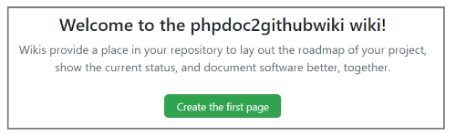

# Template to build a github wiki with phpDocumentor 3

  
 [](https://www.paypal.me/SKientzler/5.00EUR)
 
----------
## Overview

This template for **phpDocumentor 3** can be used to generate the markdown files 
for a github wiki.

Guided by the motto of phpDocumentor

> ***'Because code and documentation are meant to be together'***

github goes one step further with its wiki and provides code and documentation 
to keep at one central location. It gives the possibility of creating a clear 
documentation with simple means:

### Create a github wiki for your repository
Open the repository you want to create a wiki for on https://github.com and 
navigate to the wiki page:

> 

To set up the wiki we have to create the first page inside our repository:

> 

A github wiki for a repository is nothing other than a special repository
that can be accessed with desktop tools as well. The name of this repository 
corresponds to the name of the main repository with the extension `.wiki`
```
Repository: https://github.com/Stefanius67/phpdoc2githubwiki
Wiki:       https://github.com/Stefanius67/phpdoc2githubwiki.wiki
```
Unfortunately, the current github desktop app comes up with error 'Sorry, I
can't find any repository matching ...' when trying to clone a github wiki. 
So we have to clone it from the command line:

1. create subdirectory 'wiki' (or any other prefered name...) on your local machine
    ```bash
    md wiki
    ```
2. If this directory is inside the local path of the repository, the wiki is for, 
   **don't forget** to add the directory to the .gitignore file.
3. change to the directory
    ```bash
    cd wiki
    ```
4. clone the wiki with following command: 
    ```bash
    git clone https://github.com/Stefanius67/phpdoc2githubwiki.wiki`
    ```
    
After cloned it once, we can open the *github desktop app* and add the repository 
with `File - add local repository`. From now we can perform any operations 
(fetch, commit, pull, push,...) within the App.

### The structur of a github wiki

Although github-wiki supports other formats, I will only deal with the Markdwon 
format at this point, as this format is generated with the template presented here. 

All pages displayed in the wiki are located in the root of the wiki-repository!

the file name of a document is also the heading of the respective page, whereby 
spaces in the title are represented by '-' characters in the file name and the 
file-extension is supressed.  

A wiki can contain three special files:
1. Home.md:  the Starting Page of the wiki
   This is the page created, when setup a wiki. 
2. _Sidebar.md: a user defined sidebar
   Can be created manualy in the wiki-repository or from the wiki page on
   https://github.com: (`[+ Add a custom sidebar]` on the right of the wiki-page
3. _Footer.md: a user defined footer
   Can be created manualy in the wiki-repository or from the wiki page on
   https://github.com: (`[+ Add a custom footer]` on the bottom of the wiki-page

All files in the root of the wiki-repository in a supported format will be listed 
in alphabetical order in the *Pages* pane on the right of the wiki. As soon as a 
user-specific sidebar has been defined, the *Pages* pane is collapsed by default. 


#### References inside the wiki

To build a references inside a document to another page in the wiki just use the
filename ('-' instead of spaces but **WITHOUT** extension):
```markdown
[A Special description](./A-Special-description)
```
will output a link with the text *'A Special description'* and the href 
`A-Special-description.md`. This referencing can also be used in the `_Sidebar.md`.

#### Embedding of graphics in a wiki page

In principle, graphics from any absolute source can be included, but it is more 
interesting to include graphics that are part of the documentation.

Best praactice to do so will be, to create any subfolder (e.g. 'images') inside 
of the wiki-repository and put all images in this location.
The associated markdown should then look like this:
```markdown

```

# to be continued...


Since the github wiki don't support a directory structure for the markdownfiles it
contain, all files that are generated by phpDocumentor must be placed in the
root of the repository.
 
